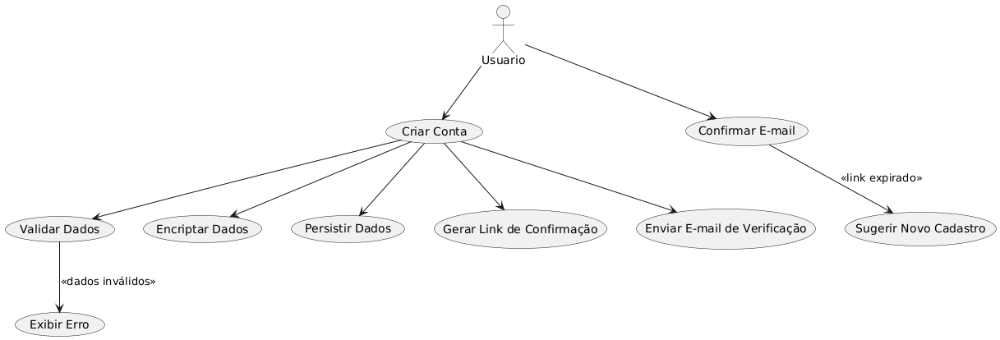

### Foram criados 2 casos de uso basicos pela equipe, para ilustrar as funções iniciais do sistema proposto:

### Criação de uma conta no sistema

* Atores:

	- Usuário

- Pré-Condições:
	- Nenhuma

* Fluxo Básico:
    1. Usuário fornece e-mail, senha e confirmações
    2. Dados do Usuário são validados pelo Sistema
    3. Dados do Usuário são encriptados pelo Sistema
    4. Dados do Usuário são persistidos pelo Sistema
    5. Sistema gera um link com prazo de expiração
    6. Sistema envia e-mail de verificação, com o link, para o Usuário
    7. Usuário confirma o e-mail antes do link expirar
    8. Sistema confirma que o Cadastro do Usuário foi realizado com sucesso

- Fluxos Alternativos:
	- 2a. E-mail do Usuário é inválido
		2a1. Sistema exibe mensagem de erro
	- 2b. Senha do Usuário não respeita regras de segurança
		- 2b1. Sistema exibe mensagem de erro
	- 3a. Usuário tenta confirmar o e-mail depois de o link expirar
		- 3a1. Sistema sugere que o Usuário realize um novo Cadastro

caso de uso(criar conta): 

### Login de usuário no sistema

- Atores:
	- Usuário

- Pré-Condições:

- Fluxo Básico:
    - 1. Usuário fornece e-mail e senha
	- 2. Sistema autentica o Usuário

- Fluxos Alternativos:
	- 2a. Dados do Usuário Inválidos
		- 2a1. Sistema exibe mensagem de erro
	- 3a. Primeio acesso do Usuário
		- 3a1. Sistema redireciona o Usuário para a página de edição de perfil
		- 
Caso de uso(login): .png)

### Funcionamento geral do sistema:

